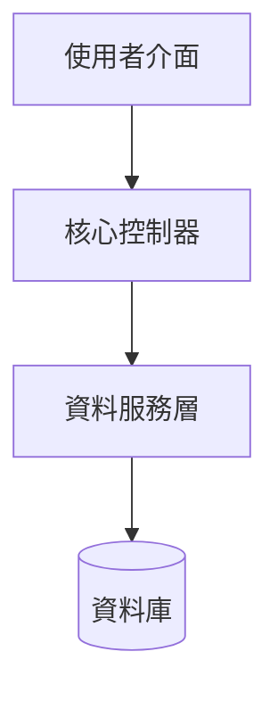

# 系統架構說明：[模組或專案名稱]

## 系統總覽

<!-- 簡要說明此專案/模組在整體系統中的角色、主要功能與設計目標 -->

## 核心設計原則

<!-- 條列在此架構設計中採用的關鍵技術債處理、效能考量或設計模式 -->

- **原則 1**：...
- **原則 2**：...

## 架構圖與資料流



<!-- 說明上述圖表的資料傳遞方向、關鍵路由、API 互動或背景處理程序 -->

## 模組說明與目錄結構

```
[專案目錄]/
├── src/
│   ├── components/      # UI 元件
│   ├── services/        # 業務邏輯與 API 串接
│   └── utils/           # 共用工具函式
```

### 關鍵模組說明

1. **[模組 A]**：負責...
2. **[模組 B]**：負責...

## 部署與運行環境

<!-- 說明本架構所需的環境變數、相依套件版本與部署注意事項 -->

- **Node.js 版本要求**：>= 18.0.0
- **關鍵相依性**：...

---

## 修訂紀錄 (Changelog)

| 日期 | 版本 | 變更摘要 | 負責人 |
|------|------|----------|--------|
| YYYY-MM-DD | 1.0 | 初始架構設計建立 | - |

---

**建立日期**: YYYY-MM-DD  
**最後更新**: YYYY-MM-DD  
**文件版本**: 1.0  
