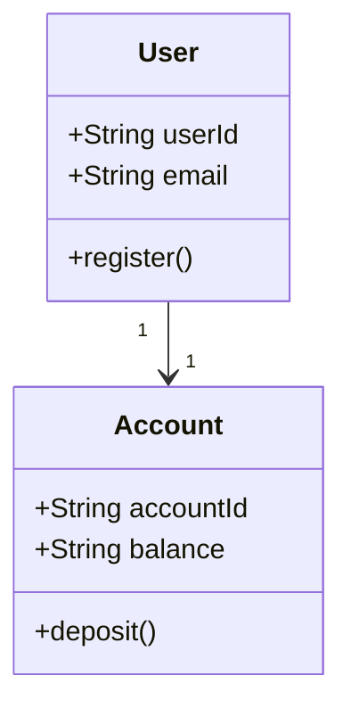

# 業務領域說明：[領域名稱]

## 業務領域概述

<!-- 說明此業務領域的核心概念、所解決的商業問題以及涉及的使用者角色 -->

## 領域實體與關係 (Domain Entities)

<!-- 說明此領域的核心實體（例如：Member, Order, Cart 等）與其主要屬性 -->

## 核心業務規則

<!-- 列出此業務領域必須強制遵守的規則、限制或驗證標準 -->

- **規則 1**：...
- **規則 2**：...

## 領域術語表 (Glossary)

| 術語 | 英文定義 | 業務解釋 |
|------|----------|----------|
| [術語 A] | [Term A] | 說明業務中的具體含意與邊界 |
| [術語 B] | [Term B] | 說明業務中的具體含意與邊界 |

## 領域事件 (Domain Events)

<!-- 說明當此領域狀態改變時，會觸發哪些非同步或同步事件，以及其訂閱者 -->

- **[事件名稱 A]**：觸發時機是...，會通知...
- **[事件名稱 B]**：觸發時機是...，會通知...

---

## 修訂紀錄 (Changelog)

| 日期 | 版本 | 變更摘要 | 負責人 |
|------|------|----------|--------|
| YYYY-MM-DD | 1.0 | 初始業務領域說明建立 | - |

---

**建立日期**: YYYY-MM-DD  
**最後更新**: YYYY-MM-DD  
**文件版本**: 1.0  
